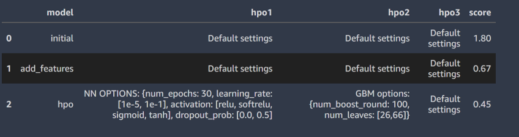

# Report: Predict Bike Sharing Demand with AutoGluon Solution
#### Rob Smith

## Initial Training
### What did you realize when you tried to submit your predictions? What changes were needed to the output of the predictor to submit your results?
My models did not face this issue, but negative values cause an issue when submitted to Kaggle. We can't have a negative number of bike customers, so it makes sense to remove any values less than 0 (in this case they are replaced with 0).

### What was the top ranked model that performed?
Autogluon automatically trains the following types of machine learning models: 

- Random Forests
- Extremely Randomized trees
- k-nearest neighbors
- LightGBM boosted trees
- CatBoost boosted trees
- AutoGluon-Tabular deep neural networks

By default, Autogluon will also test ensembling of the various base models that it trains. Rather than using a single model to make predictions, we can often combine them which results in better performance. The way that Autogluon combines the models is shown in the figure below. 


<em>Ensemble stacking performed by Autogluon ([source](https://arxiv.org/pdf/2003.06505.pdf)).</em>

Here the outputs of multiple base models are concatenated along with the original inputs as features to the next layer of models. At the end, the outputs from different models are weighted to make a prediction.

In the case of all three tests that were run in this exercise, a weighted ensemble came out with the best score. In each case a three layer stack (L3) produced the best results. An example of the output from the `leaderboard()` method is shown below, which shows the different models used in each layer:


<em>Example of stacked models used in ensembling output.</em>

## Exploratory data analysis and feature creation
### What did the exploratory analysis find and how did you add additional features?
As we might expect with this type of dataset, clear trends could be observed in the number of people renting a bike over time (both short and long scales). For instance, a box plot of the monthly demand for bike rentals is shown below.
We observe clear trends in the data, with higher demand in the warmer summer months than the cold winter months.


<em>Boxplot of monthly bike demand.</em>

Although the original data contains a `datetime` feature, it will be much easier for a model to learn from if we explicitly tell it what month a sample is in. A feature named `month` was added using the `dt` attributes of datetime data types.

```
df['month'] = df['datetime'].dt.month
```

We also have trends on much shorter timescales. A boxplot of the hourly bike usage is shown below. This clearly highlights certain time periods when bike demand is much higher (i.e. rush hour periods between 7-9 AM and 4-7PM).


<em>Boxplot of hourly bike demand.</em>

To make it easier for the model to learn, I add a feature named `demand` which was labelled as follows:

- 0: Low demand (9PM - 7AM)
- 1: Medium demand (9AM - 4PM)
- 2: High demand (7-9AM, 4-7PM)

The code to create this feature is shown below, making us of the Numpy `select` function.

```
# create a list of our conditions
conditions = [
    (df['hour'] <= 6),
    (df['hour'] >6 ) & (df['hour'] <= 9),
    (df['hour'] > 9) & (df['hour'] <= 15),
    (df['hour'] > 15) & (df['hour'] <= 19),
    (df['hour'] > 19) & (df['hour'] <=21),
    (df['hour'] > 21)
    ]

# create a list of the values we want to assign for each condition
values = [0, 2, 1, 2, 1, 0]

# 0 = low
# 1 = Medium
# 2 = High

# create a new column and use np.select to assign values to it using our lists as arguments
df['demand'] = np.select(conditions, values)
```

Note demand is a categorical feature, so we need to make sure that we change the data type in the DataFrame before training so that it is dealt with correctly. Features like the month are a bit more tricky, they could be considered as numerical (so that order has meaning) or categorical. For these tests I left it as a numerical feature.

```
df["demand"] = df["demand"].astype('category')
```

The correlation between the different features in the dataset are shown in the heatmap below:


<em>Correlation heatmap.</em>

### How much better did your model preform after adding additional features and why do you think that is?
Adding the `month` and `demand` features significantly improved the model performance. The root mean squared logarithm error (RMSLE) on the test set reduced from 1.8 to 0.67. These features make it much easier to learn important trends in the data related to time. Before it had to rely on the `datetime` column alone, which makes it much more challenging.

## Hyper parameter tuning
### How much better did your model preform after trying different hyper parameters?
For the third test I manually defined the search space for neural networks and GBM models. In terms of the assessment on the data we have for training, it actually made things slightly worse (best RMSE increased from 30.2 to 34.8). However, when it was applied to the test data the performance improved from a RMSLE of 0.67 to 0.45. Note that Autogluon uses k-fold cross-validation, which is not really the best approach for time-series data. This discrepancy may be related to this, where the data we use to evaluate is not the best representation of the data that we test on.

### If you were given more time with this dataset, where do you think you would spend more time?

The hyperparameter search performed by `autogluon` currently randomly splits the data for training and validation. However, this doesn't make sense for time series problems. In the dataset provided, we are given the data for the first 19 days of each month. We then make predictions for the last 11-12 days of each month, which is used for testing when we submit data. When dealing with time series data, points closer in time are usually more relevant. It would make more sense to split the data so that we train using the first 14-15 days of the data from each month and use the remaining days for validation. This better represents the situation we will test the model on. Once we have tuned the hyperparameters, we can train the model on all 19 days before using that to make the predictions for submission to Kaggle. I tried doing this by splitting the data as outlined above and passing the later split to the `tuning_data` parameter in the `fit()` method. However this produced an error so I may need to do this test outside of Autogluon.

### Create a table with the models you ran, the hyperparameters modified, and the kaggle score.



<em>Summary of model searches and results.</em>

### Line plot showing the top model score for the three training runs during the project.

Note that in Autogluon we used RMSE as the evaluation metric. Since it assumes that higher numbers are better, it uses the negative value of RMSE as the metric (so that higher values are better). in the plot below I made these values positive so that they make sense (i.e. we can't have negative RMSE).


<em>Best results on training data from three stages of model searches.</em>


### Line plot showing the top kaggle score for the three prediction submissions during the project.

The metric used by Kaggle is the root mean squared logarithmic error (RMSLE). Here we see improvements which each stage of model search.


<em>Best results on test data from three stages of model searches.</em>


## Summary
In this study we saw the importance of carefully preparing the data and adding features to help the model learn. The inclusion of features that identify time-related trends in the data provided a large improvement in model performance. We also saw that the best results are produced by a weighted enselble of different machine learning models. Note that the goal of this project was not to produce the very best results, so their is still cope for significant improvement.
